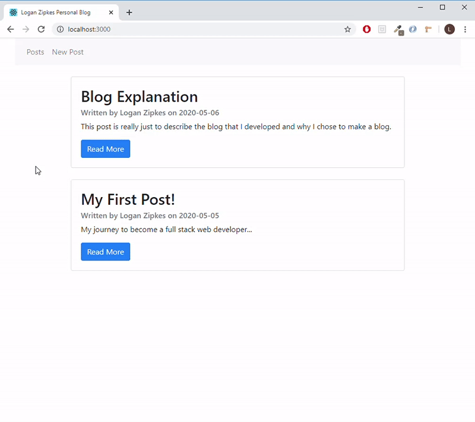

# Logan Zipkes' Blog

Welcome to my personal blog! I created this CRUD blog to share my thoughts and ideas on various topics such as: personal projects, fun development tips and tricks, and anything related to technology.

I graduated from college back in December, and since then I have focused my time and energy into learning full stack web development. This web app is the initial culmination of all the technologies that I have learned over the past couple of months, and I'm so excited to have finally finished a complete MERN project.

## Things that still need work...

- [ ] Figure out how to use async/await for api router's edit and delete requests
- [ ] Add authentication/authorization for private user functionality
  - [ ] Create a Login React component that's accessible from navbar
  - [ ] Validate user's email and password inputs in database
  - [ ] Implement sessions and cookies for authorization
  - [ ] Allow registered users to create posts, edit their own posts, and delete their own posts
  - [ ] Allow users who have not registered to only read others' posts
- [ ] Add custom CSS to the Bootstrap styles that match more closely to my own personal site
  - [ ] Add 'LZ' logo to favicon
  - [ ] Add 'LZ' logo to navbar next to 'posts'
  - [ ] Add darker colors from personal site to the background
  - [ ] Change navbar buttons to appear more like personal site's